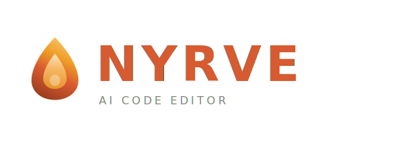

<p align="center">
  
</p>

<p align="center">
  A code editor where the AI proves its work.
</p>

---

Nyrve (*built with the help of Claude Code itself*) is a VS Code fork with Claude baked directly into the editor. Not as an extension. Not as a sidebar chat. As a core part of how the editor works. The agent runs inside the editor with full access to your files, terminal, and git. Every change it makes is type-checked, tested, and verified before you see it.

## What makes Nyrve different

**The agent verifies its own output and fixes its own mistakes.** When Nyrve modifies your code, it runs the type checker, executes relevant tests, checks coverage, and validates imports. Automatically, before showing you a single diff. If something breaks, the agent enters a self-healing loop: it reads the failure, fixes the code, and re-verifies, up to three attempts. By the time you review the changes, they've already been tested and repaired. You see the diffs alongside a verification report: what passed, what was caught and self-healed, and what percentage of changed lines are covered by tests. This is not a gimmick. It changes how much you trust AI-generated code.

**The agent builds a DNA profile of your project.** On first open, Nyrve scans your code, config files, and git history to build a structured Project DNA: your tech stack, architecture, module map, code patterns, naming conventions, file hotspots, contributor activity, and technical debt. This DNA updates incrementally as you work. The agent uses it on every request, so it follows your project's patterns without being told. It also captures architectural decisions from your conversations into a searchable Decision Journal, and maintains a shared Team Knowledge file you commit to your repo. After a week, the agent codes like someone who's read every file. After a month, it knows your project better than most of your team. This compounds. It does not reset between sessions.

**Plan before execute.** For complex changes, the agent creates a step-by-step implementation plan before writing any code. You review the plan, edit steps, reorder them, add constraints. Then the agent executes each step with verification. You stay in control of the approach while the agent handles the implementation.

## Core capabilities

Nyrve ships with everything you need to use it as your primary editor:

**Inline completions.** Ghost text appears as you type, powered by Claude Haiku for speed. Completions are aware of your project's conventions and pass a quick type check before they appear. Tab to accept. Under 300ms latency.

**Agent panel.** A persistent chat interface inside the editor. The agent sees your open files, cursor position, terminal output, git status, and diagnostics in real time. It reads and writes files, runs commands, creates commits, and creates pull requests, with the confirmation level you choose.

**Codebase indexing.** A local embedding index of your project, built in Rust. The agent finds relevant code in milliseconds without reading every file. Incremental updates on every save.

**Context control.** Scope what the agent sees with @-mentions: `@file`, `@folder`, `@symbol`, `@git-diff`, `@errors`, `@tests`, `@search`, `@terminal`, `@docs`, and more. Define custom mentions for your project.

**Diff review.** Agent changes appear as reviewable diffs inside the editor. Accept, reject, or edit per-hunk. Verification report shown alongside every changeset.

**Background monitoring.** The agent watches your code as you work and surfaces bugs, security issues, missing tests, and refactoring opportunities in a non-intrusive sidebar. Configurable severity and categories.

**Image understanding.** Paste a screenshot, drag in a mockup, or capture your screen. The agent reads error messages, implements designs, and interprets diagrams using Claude's vision capabilities.

**GitHub integration.** One-click PR creation from agent work with auto-generated descriptions. Issue-to-implementation pipelines. Review comment handling. CI failure analysis.

**Task queue.** Queue multiple tasks and let the agent work through them. Each task is verified independently. Pause, reorder, or cancel at any time.

## The model

Nyrve uses the Anthropic API directly. You bring your own API key and pay Anthropic for usage. There is no Nyrve backend, no proxy, no account to create. Your key is stored in your OS keychain and never leaves your machine.

All Claude models are supported. Nyrve routes tasks to the right model by default: Haiku for completions and background analysis, Sonnet for general work, Opus for complex planning and multi-file edits. You can override this per feature.

## Quick start

```bash
# Clone the repo
git clone https://github.com/malwarebo/nyrve.git
cd nyrve

# Install dependencies
npm install

# Build
npm run compile

# Launch
./scripts/code.sh
```

On first launch, Nyrve will ask for your Anthropic API key. Get one at [console.anthropic.com](https://console.anthropic.com).

## Configuration

Nyrve has a dedicated settings page (`Nyrve > Settings` or `Cmd+Shift+A` → gear icon) covering:

- **Models** — Choose which Claude model to use for each feature
- **Agent** — Confirmation level (cautious / balanced / autonomous), custom system prompt
- **Verification** — Toggle type checking, tests, coverage thresholds, self-heal attempts
- **Memory** — Project DNA scanning, decision journal extraction, team knowledge suggestions
- **Completions** — Trigger delay, max lines, quick type check toggle
- **Plan Mode** — Auto-suggest threshold, step-by-step or auto-proceed
- **Vision** — Screenshot capture, compression, EXIF stripping
- **Background Agent** — Mode (active / on-save / on-commit), categories, token budget

Per-project overrides via `.nyrve/config.json`. Global settings at `~/.nyrve/settings.json`.

## Built on VS Code

Nyrve is a fork of [VS Code](https://github.com/microsoft/vscode). All VS Code extensions, themes, keybindings, and settings work. If you use VS Code today, Nyrve feels familiar on day one. The difference is everything behind the `src/nyrve/` directory: the agent, the verification engine, the memory system, and every integration point between them.

## Building

### Prerequisites

- Node.js 18+
- Python 3 (for native modules)
- C++ toolchain (GCC/Clang on Linux, Xcode on macOS, MSVC on Windows)

### Development

```bash
npm install
npm run compile
./scripts/code.sh       # macOS/Linux
./scripts/code.bat      # Windows
```

### Platform builds

Builds use gulp. The task pattern is `vscode-{platform}-{arch}[-min]`. The `-min` suffix produces a minified production build.

```bash
# macOS
npm run gulp vscode-darwin-arm64-min
npm run gulp vscode-darwin-x64-min

# Windows
npm run gulp vscode-win32-x64-min
npm run gulp vscode-win32-arm64-min

# Linux
npm run gulp vscode-linux-x64-min
npm run gulp vscode-linux-arm64-min
```

Output goes to `../VSCode-{platform}-{arch}/`.

### Platform installers

After building, create distributable packages:

**Linux** (.deb, .rpm, .snap):

```bash
npm run gulp vscode-linux-x64-build-deb
npm run gulp vscode-linux-x64-build-rpm
npm run gulp vscode-linux-x64-build-snap
```

**Windows** (.exe installer):

```bash
npm run gulp vscode-win32-x64-setup
npm run gulp vscode-win32-arm64-setup
```

**macOS** (universal .app):
Handled by `build/darwin/create-universal-app.ts` after building both x64 and arm64 targets.

### CI

The full multi-platform build pipeline is in `build/azure-pipelines/product-build.yml`. It builds all targets in parallel: Windows (x64, arm64), macOS (x64, arm64, universal), Linux (x64, arm64, armhf), Alpine (x64, arm64).

### Validation

```bash
npm run compile-check-ts-native   # TypeScript compilation check
npm run valid-layers-check        # Architecture layering validation
scripts/test.sh                   # Unit tests
scripts/test.sh --grep "Nyrve"    # Nyrve-specific tests
scripts/test-integration.sh       # Integration tests
```

## Project files

Nyrve stores project-specific data in `.nyrve/` at your workspace root:

```
.nyrve/
├── config.json            # Project settings (overrides global)
├── team-knowledge.md      # Shared knowledge base (commit this)
├── mentions.json          # Custom @-mention definitions
├── pr-template.md         # PR description template
├── index.db               # Codebase index
├── memory.db              # Decision journal and session memory
├── project-dna.json       # Auto-generated project understanding
├── tasks.db               # Task queue persistence
└── plans/                 # Saved plans
```

`team-knowledge.md` is the one file meant to be committed. Everything else is local.
